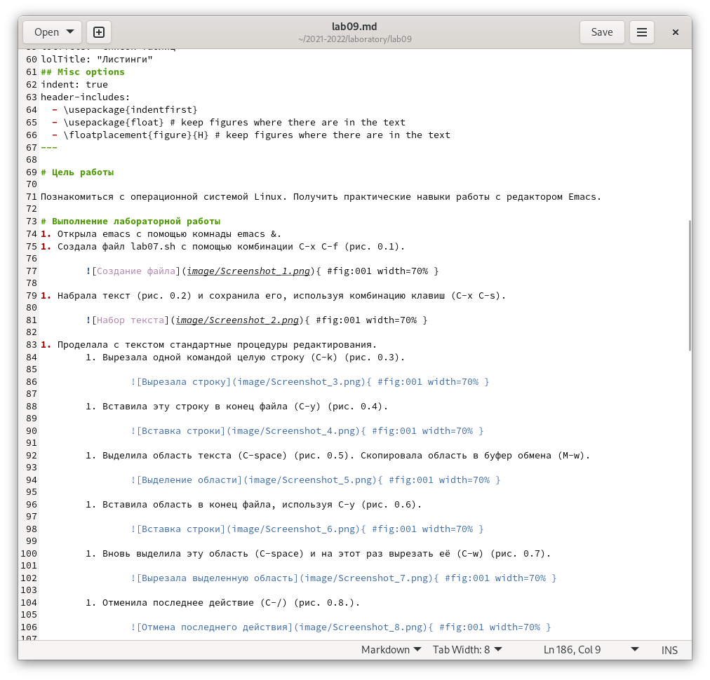

## Для создания отчёта мы используем markdown

- Markdown — облегчённый язык разметки, созданный с целью обозначения форматирования в простом тексте, с максимальным сохранением его читаемости человеком, и пригодный для машинного преобразования в языки для продвинутых публикаций (HTML, Rich Text и других).
- Чтобы пронумеровать действия нужно написать "1. ", если нужен ненумерованный список, нужно написать "- " перед текстом.
- Чтобы вставить картинку с подписью нужно поставить восклицательный знак в квадратные скобки нужно написать подпись картинки, а в круглые нужно ввести название картинки, если картинка лежит не в каталоге с отчётом, нужно ввести её путь.

## Отчёт

В отчёте нужно писать свои действия, совершённые во время лабораторной работы. В начале отчёта нужно писать цель, а в конце вывод работы. Текст нужно дополнять скриншотами, сделанными во время лабораторной работы. Также в конце нужно ответить на контрольные вопросы. 
