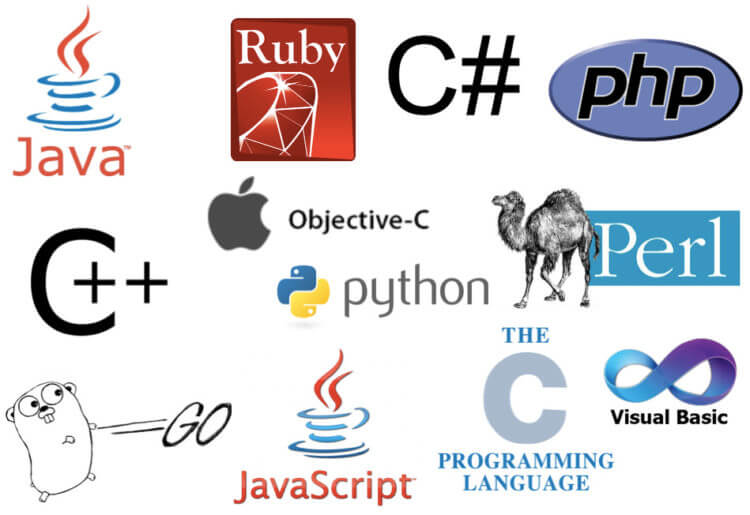

## Bash
Сценарии командной оболочки Unix, созданные Кеном Томпсоном в начале 1970-х годов, тесно связаны с языком программирования C. Bash — обновленная оболочка Unix — была впервые выпущена в конце 80-х годов и до сих пор активно разрабатывается. На Bash обычно пишутся сценарии конфигурации сервера, поэтому это хороший выбор для работы в современных облачных средах с контейнерным хранением и микросервисами. Скрипты командной оболочки используются достаточно часто, так что знание этого языка пригодится.

Также стоит обратить внимание на zsh, который в настоящее время является оболочкой по умолчанию в macOS.

Области применения: администрирование сервера, инструменты интерфейса командной строки, DevOps, виртуализация.

## COBOL
Один из старейших языков, используемых до сих пор, был создан Грейс Хоппер в конце 1950-х годов и предназначался для стандартизации разработки крупномасштабных бизнес-приложений на компьютерах. Блестящая концепция, которая до сих пор применяется в кроссплатформенных SDK. Через системы COBOL проходят невероятные 95% транзакций ATM, причем многие из этих устройств работают круглосуточно 365 дней в году. Такие поставщики устройств, как IBM, разрабатывают более мощные машины, предназначенные для COBOL, но продолжают обслуживать и обновлять существующие системы из-за затрат и рисков, связанных с их заменой. В ближайшее время COBOL никуда не уйдет. Это хороший выбор для тех, кто хочет работать с клиентами из финансовой сферы.

Области применения: банковское дело / финансы, международные корпорации, правительства.

## C/C++
Эти языки часто занимают вершины различных рейтингов — их ценят за мощность и быстродействие. C был создан в начале 1970-х годов Деннисом Ритчи, C ++ в 1985 году разработал Бьёрн Страуструп. Сегодня два этих языка лежат в основе всего: от ОС и игр до современных научных вычислений и машинного обучения. C и C++ хорошо подходят для требовательных приложений, которым важны низкоуровневый доступ к оборудованию и производительность. Для освоения этих языков нужно время и определенные усилия.

Область применения: разработка ОС / SDK, встроенные устройства, игровые движки, наука.

## C#
C#, выпущенный Microsoft в 2000 году, был разработан Андерсом Хейлсбергом как кроссплатформенный язык объектно-ориентированного программирования. Сейчас он часто используется для разработки бизнес-приложений, API, игр и многого другого. Благодаря широкому набору функций этот язык подходит для работы с графикой и других задач асинхронного программирования.

Области применения: корпоративные приложения, разработка программного и пользовательского интерфейса, игры, графика.

## Dart
Современный язык, разработанный в Google для создания мобильных, десктопных, веб-и серверных приложений. Его создатель Ларс Бак также придумал JavaSript Engine V8. Dart напоминает другие современные языки объектно-ориентированного программирования — C #, TypeScript и Java — и предоставляет обширный набор функций, подходящих для определения сложных взаимодействий, асинхронных операций, анимации и других задач.

Области применения: кроссплатформенные приложения, облачные сервисы / корпоративные системы, игры, графика.

## Fortran
Fortran, разработанный в IBM в 1950-х годах Джоном Бакусом, — это язык общего назначения, который был создан для проведения научных и инженерных работ. Он до сих пор широко используется в этих целях, в том числе для контрольного тестирования самых быстрых суперкомпьютеров в мире. Он также применялся в космических и физических исследованиях и моделировании погоды.

Области применения: аэрокосмическая/оборонная промышленность, научные вычисления, численный анализ.

## Java
Java — это ООП-язык общего назначения, разработанный в 1990-х годах Джеймсом Гослингом в Sun (сейчас принадлежит Oracle) и предназначенный для компиляции в байт-код для запуска на виртуальной машине Java. К 2020 году к ним относятся практически все виды устройств — от телевизоров и игровых приставок до серверов, телефонов и даже кухонных приборов. Язык широко распространен в корпорациях и университетах, что сделало его популярным как среди начинающих программистов, так и среди опытных разработчиков.

Области применения: корпоративные приложения, встроенные системы, веб-сервисы, игры.

## JavaScript
JavaScript разработал Брэндон Айх в 1990-х годах, чтобы добавлять выполнение скриптов на сайты. Сегодня это универсальный язык веб-интерфейса с мощными стандартизированными функциями, которые поддерживаются всеми основными браузерами. JavaScript соответствует стандарту EcmaScript, который обновляется каждые несколько лет с добавлением новых спецификаций языка. Кроме того, JavaScript часто используется для разработки серверных служб и API, мобильных приложений, игр и другого программного обеспечения. Это отличный выбор для изучения и дальнейшего совершенствования.

Области применения: фулстэк-разработка, облачные сервисы / контейнерное хранение, игры, утилиты.

