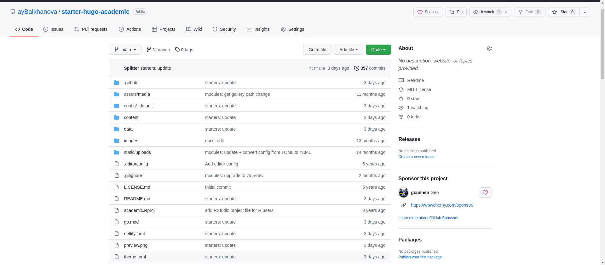
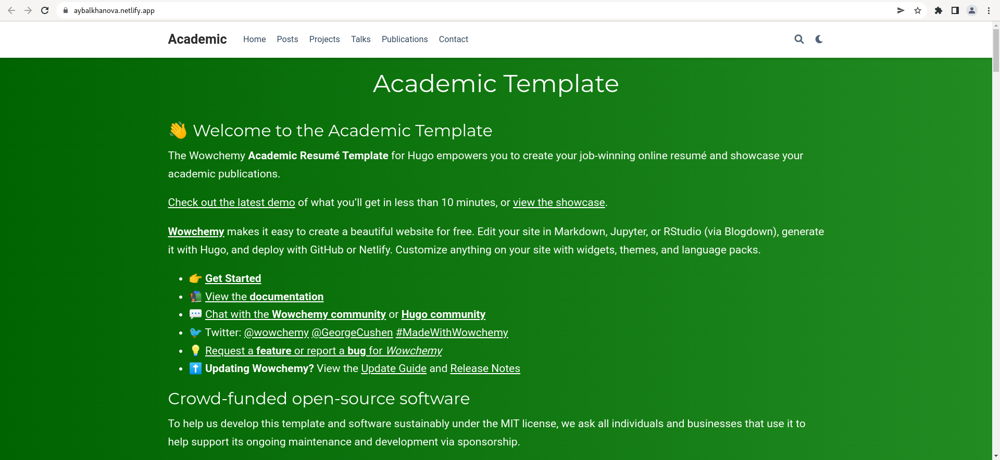
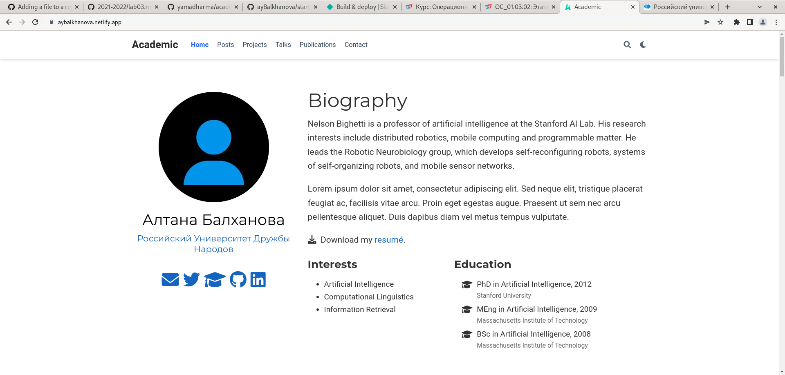

## Задание

- Установить необходимое программное обеспечение.
- Скачать шаблон темы сайта.
- Разместить его на хостинге git.
- Установить параметр для URLs сайта.
- Разместить заготовку сайта на Github pages.

## Ход работы

1. Установила hugo: (рис. [-@fig:001])

{ #fig:001 width=70% }

1. Скачала шаблон темы сайта и разместила его на github: (рис. [-@fig:002])

{ #fig:002 width=70% }

1. Создала сайт(рис. [-@fig:003] и прикрепила к github(рис. [-@fig:004]): 

{ #fig:3 width=70% }

{ #fig:004 width=70% }

1. Установила URL сайта [https://aybalkhanova.netlify.app](https://aybalkhanova.netlify.app): (рис. [-@fig:005])

{ #fig:005 width=70% }

1. Так выглядит скачанный шаблон сайта: (рис. [-@fig:006], [-@fig:007])

{ #fig:006 width=70% }

{ #fig:007 width=70% }

1. Изменила имя и организацию: (рис. [-@fig:008]) 

{ #fig:008 width=70% }

## License

Copyright 2016-present [George Cushen](https://georgecushen.com).

Released under the [MIT](https://github.com/wowchemy/wowchemy-hugo-modules/blob/master/LICENSE.md) license.
