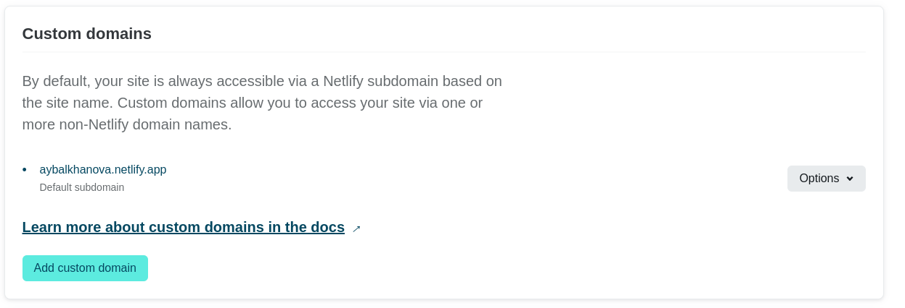

## Задание

- Установить необходимое программное обеспечение.
- Скачать шаблон темы сайта.
- Разместить его на хостинге git.
- Установить параметр для URLs сайта.
- Разместить заготовку сайта на Github pages.

## Ход работы

1. Установила hugo: 

  

1. Скачала шаблон темы сайта и разместила его на github: 

  

1. Создала сайт и прикрепила к github: 

  

  

1. Установила URL сайта [https://aybalkhanova.netlify.app](https://aybalkhanova.netlify.app): 

  

1. Так выглядит скачанный шаблон сайта: 

  

  

1. Изменила имя и организацию: 

  

