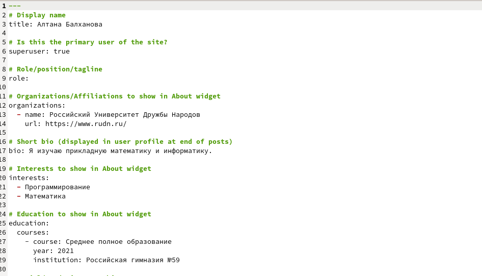
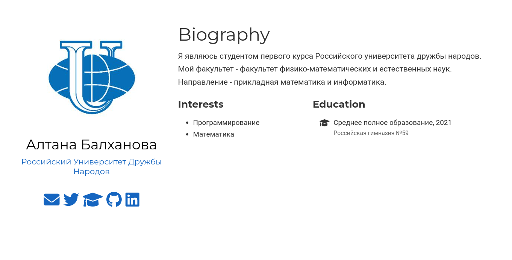
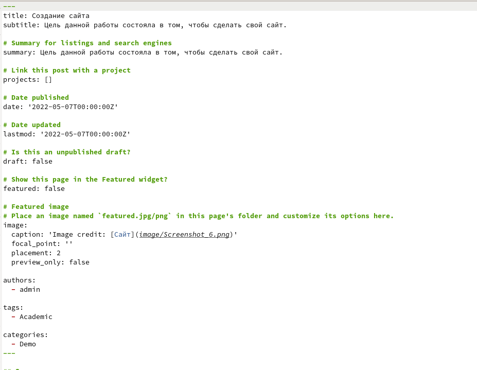
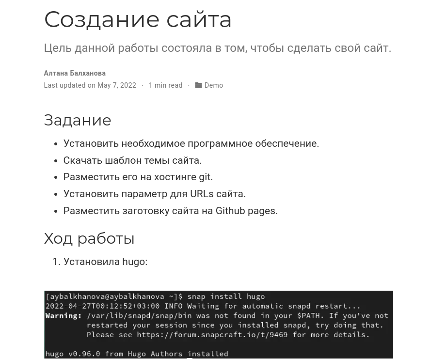
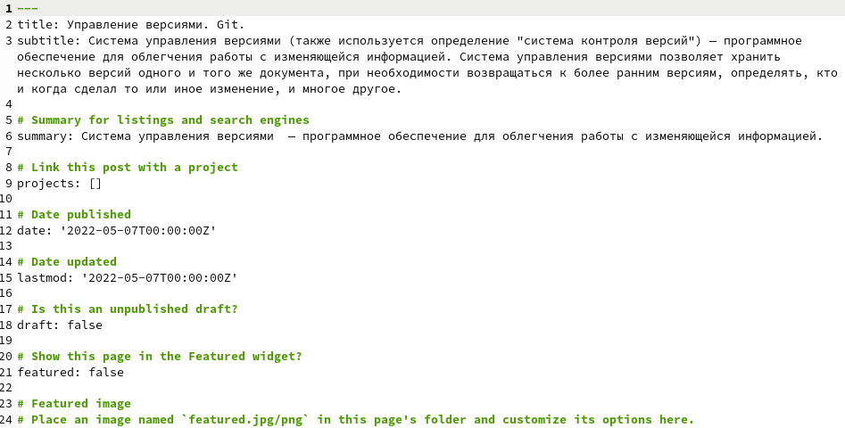
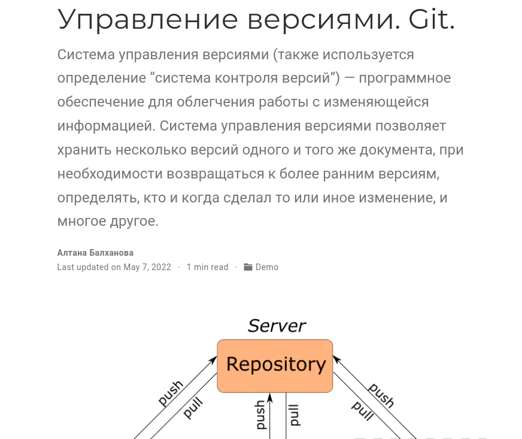
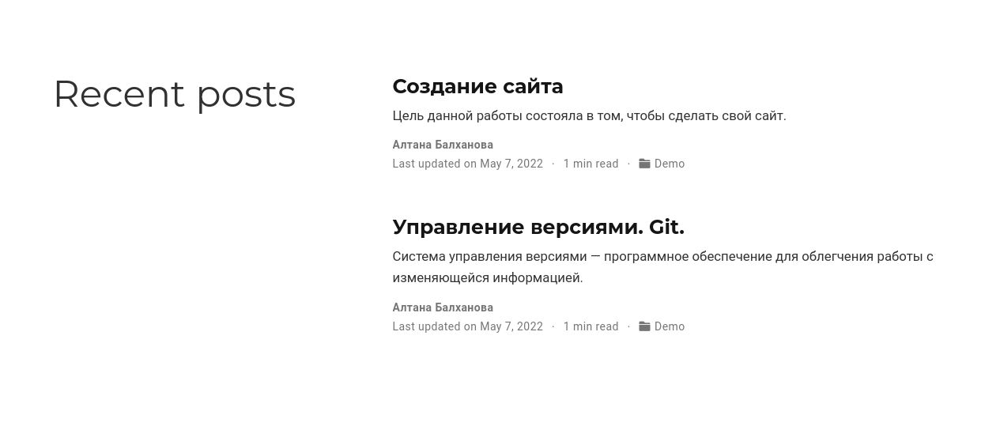

## Задание

- Список добавляемых данных.
	- Разместить фотографию владельца сайта.
	- Разместить краткое описание владельца сайта (Biography).
	- Добавить информацию об интересах (Interests).
	- Добавить информацию от образовании (Education).
- Сделать пост по прошедшей неделе.
- Добавить пост на тему по выбору:
	- Управление версиями. Git.
	- Непрерывная интеграция и непрерывное развертывание (CI/CD).

## Выполнение работы
1. Добавила данные о себе: биографию, интересы, образование, фотографию:

	

	
	
1. Сделала пост о выполнении индивидуального проекта на прошлой неделе:
	
	
		
	
		
1. Сделала пост об управлении версиями. Git.
	
	
		
	
		
1. Посты:
	
	
	
# Выводы

- Я написала свою биографию и первые посты.

