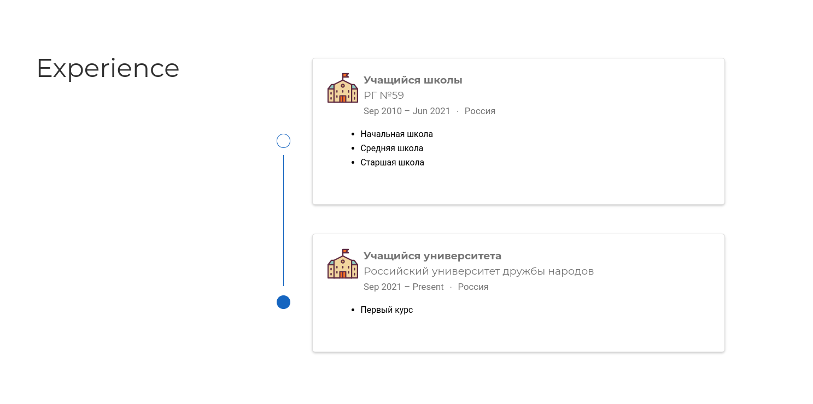

## Задание

- Список достижений.
	- Добавить информацию о навыках (Skills).
	- Добавить информацию об опыте (Experience).
	- Добавить информацию о достижениях (Accomplishments).
- Сделать пост по прошедшей неделе.
- Добавить пост на тему по выбору:
	- Легковесные языки разметки.
	- Языки разметки. LaTeX.
	- Язык разметки Markdown.

## Выполнение работы
1. Добавила список достижений: навыки, опыт, достижения:

	{ #fig:001 width=70% }

	{ #fig:001 width=70% }
	
	{ #fig:001 width=70% }

	{ #fig:001 width=70% }
	
1. Сделала пост о выполнении индивидуального проекта на прошлой неделе:
	
	{ #fig:001 width=70% }
		
	{ #fig:001 width=70% }
		
1. Сделала пост о языке разметки. LaTeX.
	
	{ #fig:001 width=70% }
		
	{ #fig:001 width=70% }
		
1. Посты:
	
	{ #fig:001 width=70% }
	
# Выводы

- Я написала свою биографию и первые посты.

