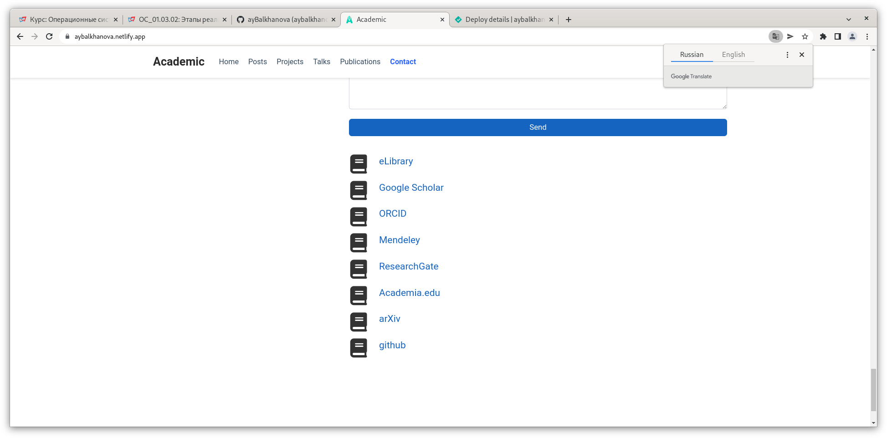
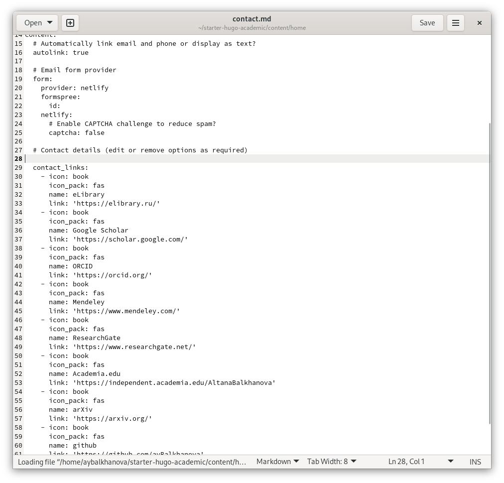
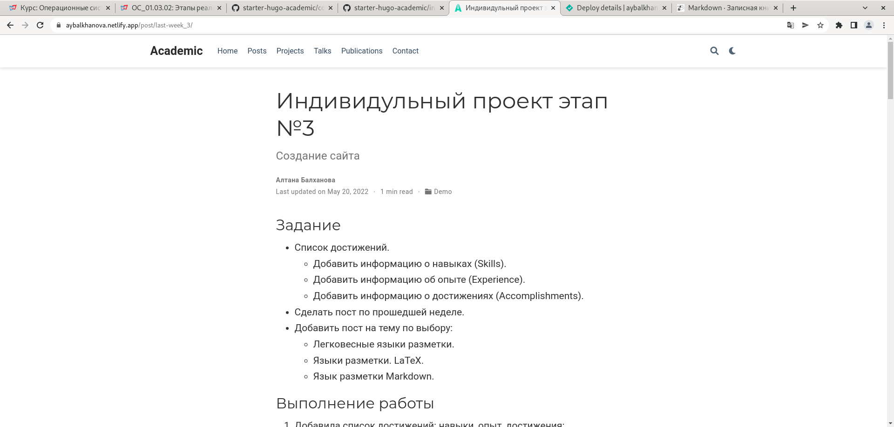
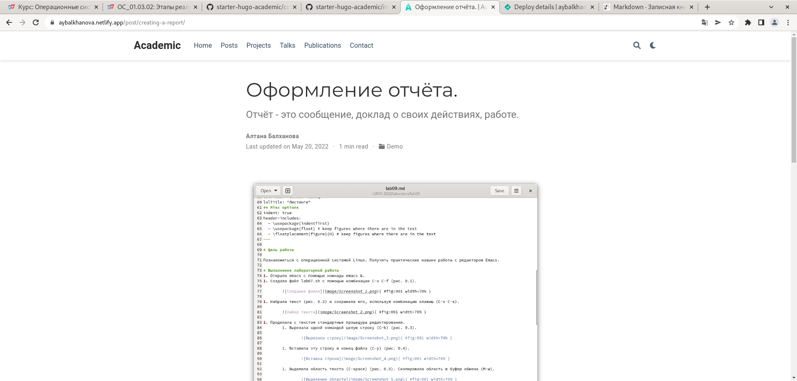
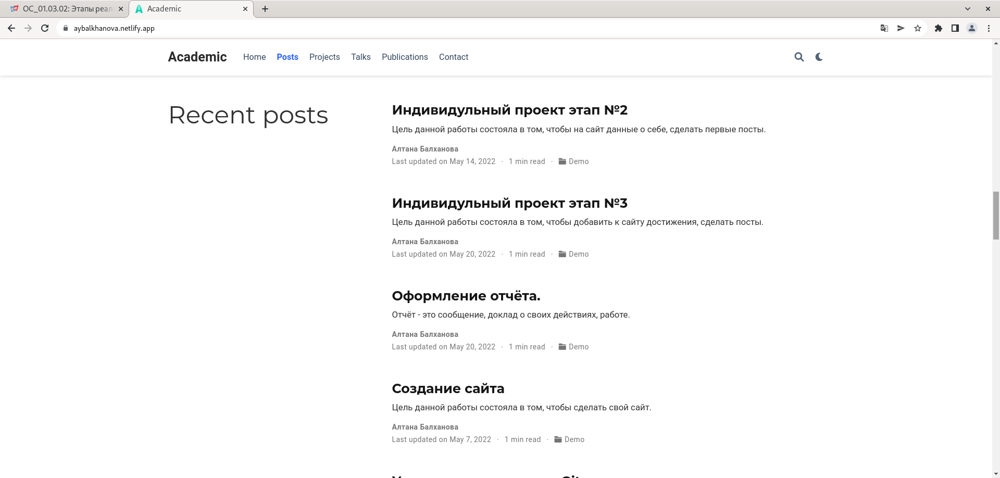

## Задание

- Добавить к сайту ссылки на научные и библиометрические ресурсы.
	- Зарегистрироваться на соответствующих ресурсах и разместить на них ссылки на сайте:
		- eLibrary : https://elibrary.ru/;
		- Google Scholar : https://scholar.google.com/;
		- ORCID : https://orcid.org/;
		- Mendeley : https://www.mendeley.com/;
		- ResearchGate : https://www.researchgate.net/;
		- Academia.edu : https://www.academia.edu/;
		- arXiv : https://arxiv.org/;
		- github : https://github.com/.
	- Сделать пост по прошедшей неделе.
	- Добавить пост на тему по выбору:
		- Оформление отчёта.
		- Создание презентаций.
		- Работа с библиографией.

## Выполнение работы
1. Зарегистрировалась на соответствующих ресурсах и разместила на них ссылка на сайте:

	{ #fig:001 width=70% }

	{ #fig:001 width=70% }
	
1. Сделала пост о выполнении индивидуального проекта на прошлой неделе:
		
	{ #fig:001 width=70% }
		
1. Сделала пост об оформлении отчёта.
		
	{ #fig:001 width=70% }
		
1. Посты:
	
	{ #fig:001 width=70% }
	
	
# Выводы

- Я добавила к сайту cсылка на научные и библиметрические ресурсы, сделала пост по выполнению индивидуального проекта на прошедшей неделе и сделала пост об оформлении отчёта.

