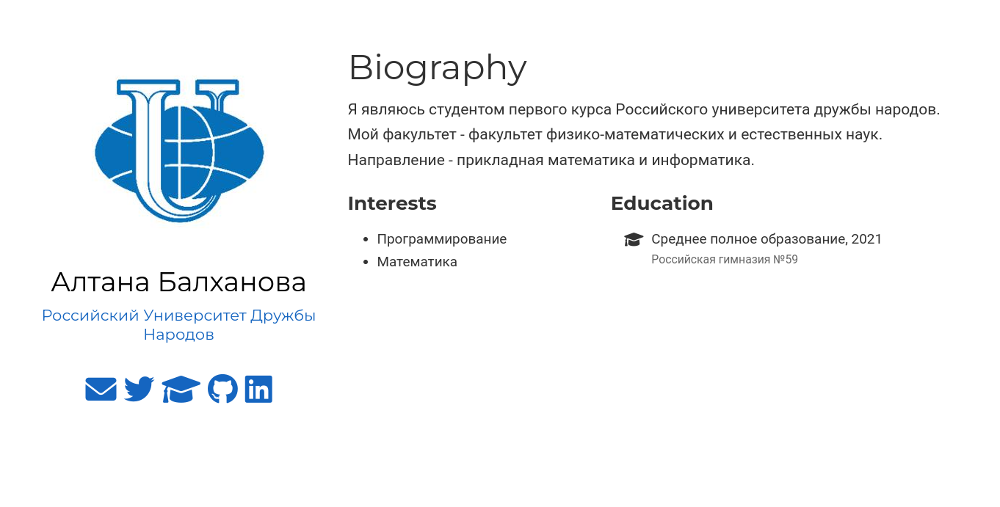
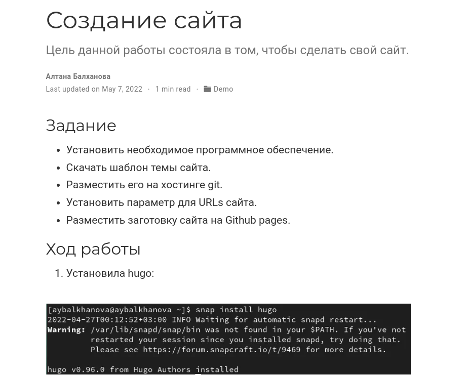
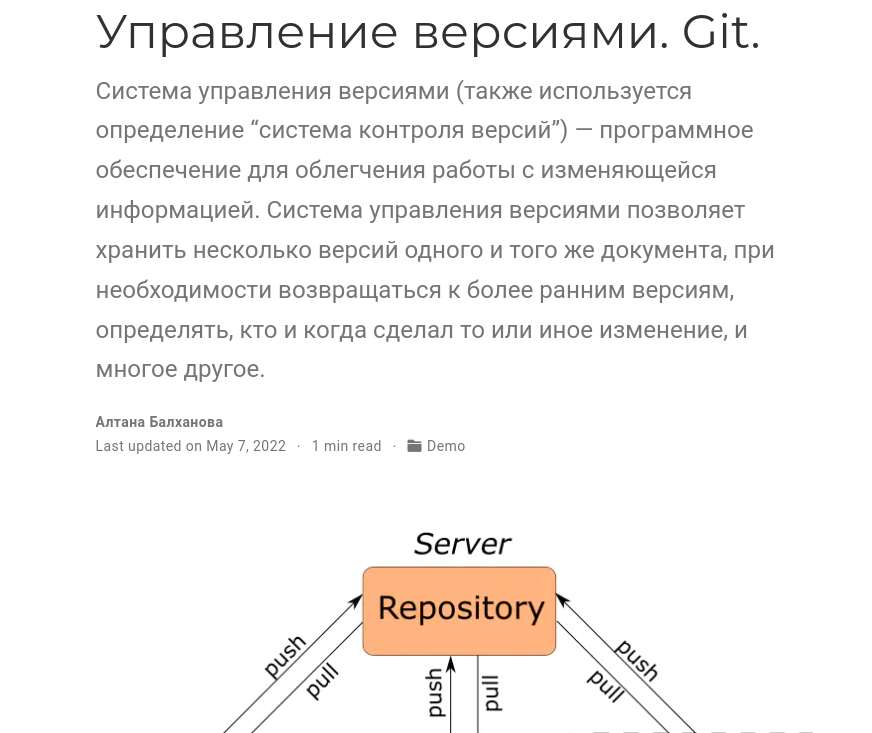

---
## Front matter
marp: true
lang: ru-RU
title: Презентация по индивидуальному проекту. Этап № 2.
author: |
	Балханова Алтана 
	НПМбд-03-21
institute: |
	\inst{1}RUDN University, Moscow, Russian Federation
date: NEC--2022, 28 April, 2022 Moscow, Russian Federation
## Formatting
toc: false
slide_level: 2
theme: metropolis
header-includes: 
 - \metroset{progressbar=frametitle,sectionpage=progressbar,numbering=fraction}
 - '\makeatletter'
 - '\beamer@ignorenonframefalse'
 - '\makeatother'
aspectratio: 43

---

# Презентация по индивидуальному проекту. Этап № 2.
Балханова Алтана 
НПМбд-03-21
RUDN University, Moscow, Russian Federation
28 April, 2022 Moscow, Russian Federation

---
# Второй этап индивидуального проекта

---

## Цель работы

- Добавить к сайту данные о себе, сделать первые посты.

---

# Задание

- Список добавляемых данных.
	- Разместить фотографию владельца сайта.
	- Разместить краткое описание владельца сайта (Biography).
	- Добавить информацию об интересах (Interests).
	- Добавить информацию от образовании (Education).
- Сделать пост по прошедшей неделе.
- Добавить пост на тему по выбору:
	- Управление версиями. Git.
	- Непрерывная интеграция и непрерывное развертывание (CI/CD).

---

## Данные о себе

---

## Пост о выполнении индивидуального проекта

---

## Пост об управлении версиями. Git.

---
## Вывод

- Я написала свою биографию и первые посты.

---
  # Спасибо за внимание

