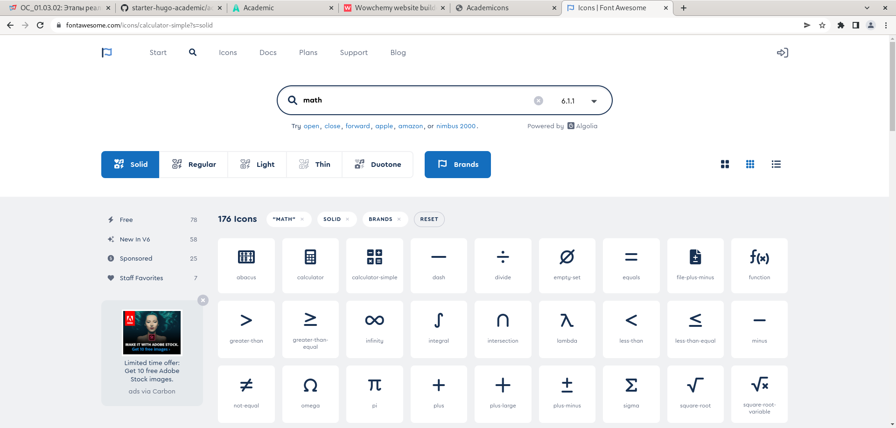
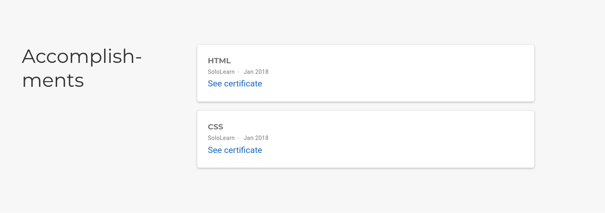
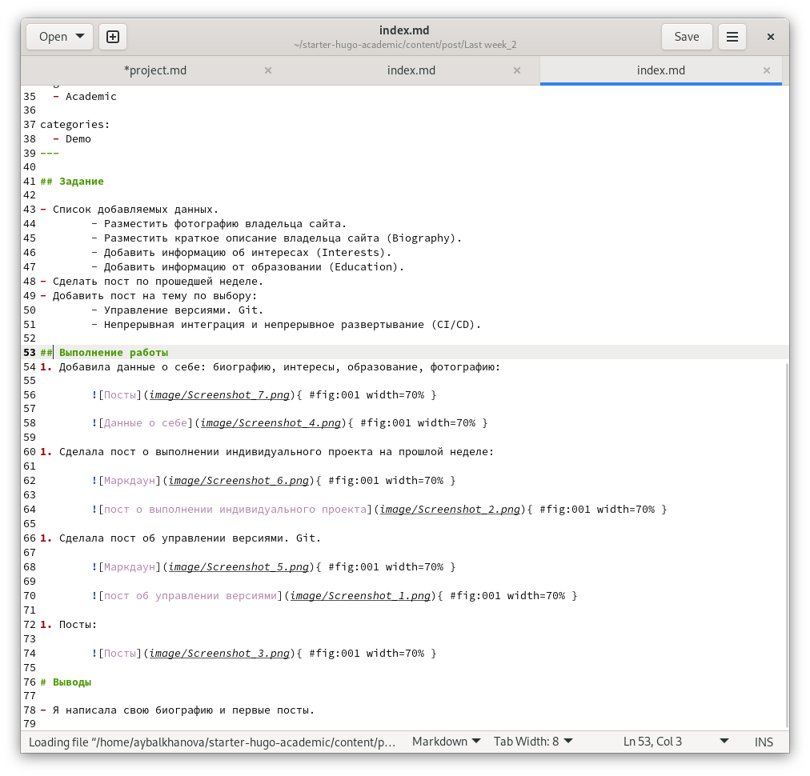
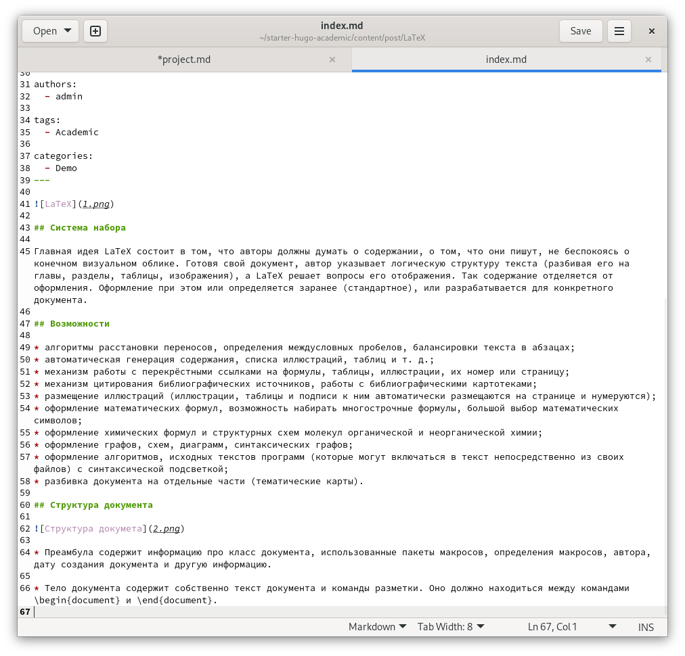
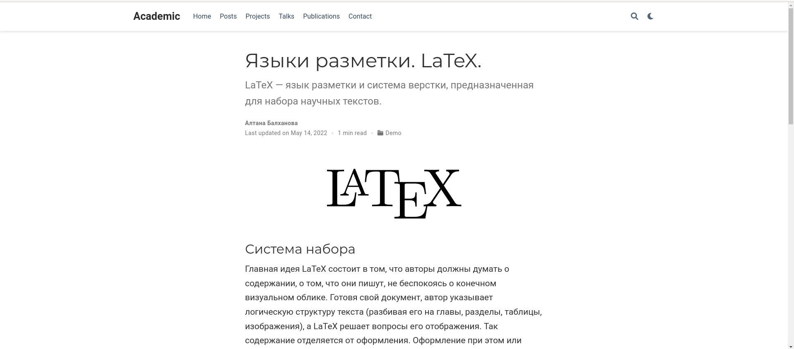
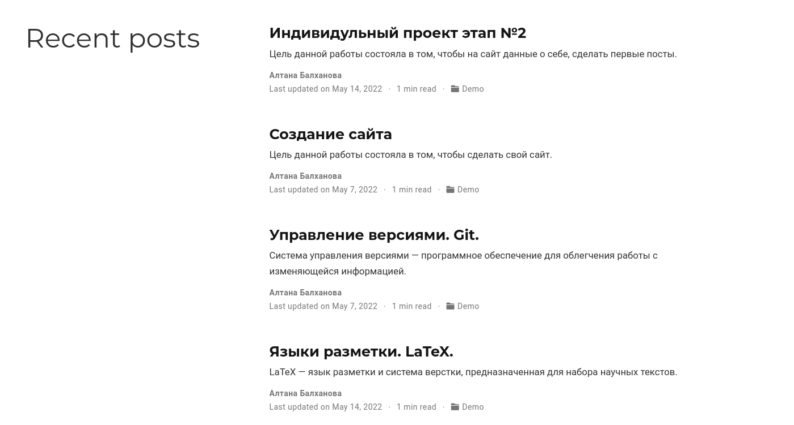

---
## Front matter
title: "3 этап индивидуального проекта"
subtitle: "Операционные системы"
author: "Балханова Алтана Юрьевна"

## Generic otions
lang: ru-RU
toc-title: "Содержание"

## Bibliography
bibliography: bib/cite.bib
csl: pandoc/csl/gost-r-7-0-5-2008-numeric.csl

## Pdf output format
toc: true # Table of contents
toc-depth: 2
pandoc_args: --top-level-division=chapter
lof: true # List of figures
lot: true # List of tables
fontsize: 12pt
linestretch: 1.5
papersize: a4
documentclass: scrreprt
## I18n polyglossia
polyglossia-lang:
  name: russian
  options:
	- spelling=modern
	- babelshorthands=true
polyglossia-otherlangs:
  name: english
## I18n babel
babel-lang: russian
babel-otherlangs: english
## Fonts
mainfont: PT Serif
romanfont: PT Serif
sansfont: PT Sans
monofont: PT Mono
mainfontoptions: Ligatures=TeX
romanfontoptions: Ligatures=TeX
sansfontoptions: Ligatures=TeX,Scale=MatchLowercase
monofontoptions: Scale=MatchLowercase,Scale=0.9
## Biblatex
biblatex: true
biblio-style: "numeric"
biblatexoptions:
  - parentracker=true
  - backend=biber
  - hyperref=auto
  - language=auto
  - autolang=other*
  - citestyle=numeric
## Pandoc-crossref LaTeX customization
figureTitle: "Рис."
tableTitle: "Таблица"
listingTitle: "Листинг"
lofTitle: "Список иллюстраций"
lotTitle: "Список таблиц"
lolTitle: "Листинги"
## Misc options
indent: true
header-includes:
  - \usepackage{indentfirst}
  - \usepackage{float} # keep figures where there are in the text
  - \floatplacement{figure}{H} # keep figures where there are in the text
---

# Цель работы

Добавить к сайту достижения, сделать посты.

# Задание

- Список достижений.
	- Добавить информацию о навыках (Skills).
	- Добавить информацию об опыте (Experience).
	- Добавить информацию о достижениях (Accomplishments).
- Сделать пост по прошедшей неделе.
- Добавить пост на тему по выбору:
	- Легковесные языки разметки.
	- Языки разметки. LaTeX.
	- Язык разметки Markdown.

# Выполнение работы
1. Добавила список достижений: навыки, опыт, достижения:

	{ #fig:001 width=70% }

	{ #fig:001 width=70% }
	
	{ #fig:001 width=70% }

	{ #fig:001 width=70% }
	
1. Сделала пост о выполнении индивидуального проекта на прошлой неделе:
	
	{ #fig:001 width=70% }
		
	{ #fig:001 width=70% }
		
1. Сделала пост о языке разметки. LaTeX.
	
	{ #fig:001 width=70% }
		
	{ #fig:001 width=70% }
		
1. Посты:
	
	{ #fig:001 width=70% }
	
# Выводы

- Я добавила к сайту достижения и написала несколько постов.

