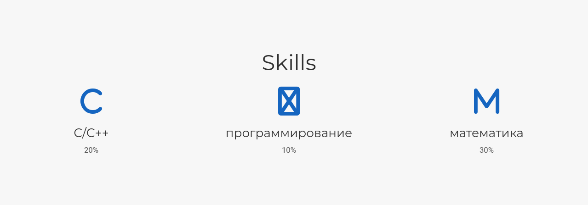
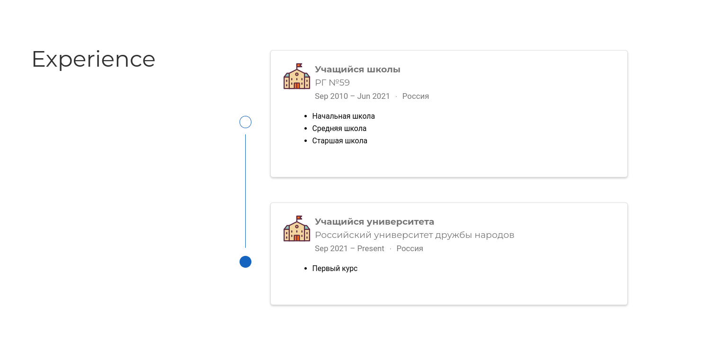
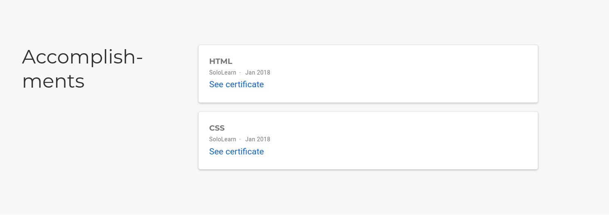
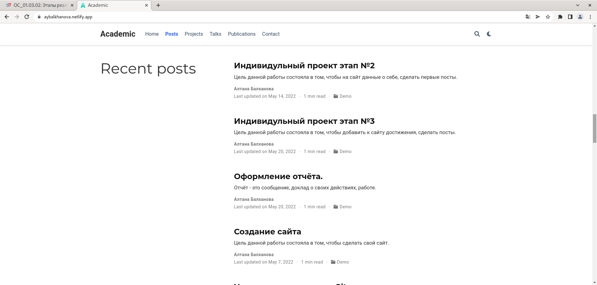

---
## Front matter
marp: true
lang: ru-RU
title: Презентация по индивидуальному проекту. Этап № 3.
author: |
	Балханова Алтана 
	НПМбд-03-21
institute: |
	\inst{1}RUDN University, Moscow, Russian Federation
date: NEC--2022, 28 April, 2022 Moscow, Russian Federation
## Formatting
toc: false
slide_level: 2
theme: metropolis
header-includes: 
 - \metroset{progressbar=frametitle,sectionpage=progressbar,numbering=fraction}
 - '\makeatletter'
 - '\beamer@ignorenonframefalse'
 - '\makeatother'
aspectratio: 43

---

# Презентация по индивидуальному проекту. Этап № 3.
Балханова Алтана 
НПМбд-03-21
RUDN University, Moscow, Russian Federation
28 April, 2022 Moscow, Russian Federation

---
# Третий этап индивидуального проекта

---

## Цель работы

- Добавить к сайту достижения, сделать посты.

---

# Задание

- Список достижений.
	- Добавить информацию о навыках (Skills).
	- Добавить информацию об опыте (Experience).
	- Добавить информацию о достижениях (Accomplishments).
- Сделать пост по прошедшей неделе.
- Добавить пост на тему по выбору:
	- Легковесные языки разметки.
	- Языки разметки. LaTeX.
	- Язык разметки Markdown.

---

## Данные о себе

	

---

## Пост о выполнении индивидуального проекта

---

## Пост о языке разметки. LaTeX.

---
## Вывод

- Я добавила к сайту достижения и написала несколько постов.

---
  # Спасибо за внимание

