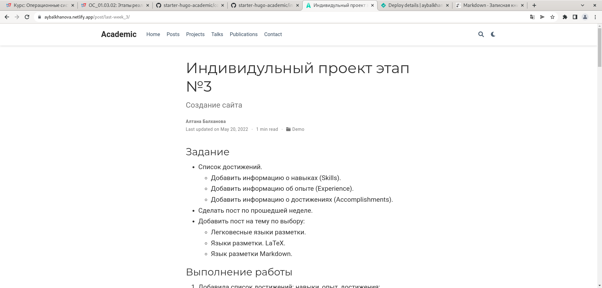

---
## Front matter
marp: true
lang: ru-RU
title: Презентация по индивидуальному проекту. Этап № 4.
author: |
	Балханова Алтана 
	НПМбд-03-21
institute: |
	\inst{1}RUDN University, Moscow, Russian Federation
date: NEC--2022, 28 April, 2022 Moscow, Russian Federation
## Formatting
toc: false
slide_level: 2
theme: metropolis
header-includes: 
 - \metroset{progressbar=frametitle,sectionpage=progressbar,numbering=fraction}
 - '\makeatletter'
 - '\beamer@ignorenonframefalse'
 - '\makeatother'
aspectratio: 43

---

# Презентация по индивидуальному проекту. Этап № 4.
Балханова Алтана 
НПМбд-03-21
RUDN University, Moscow, Russian Federation
28 April, 2022 Moscow, Russian Federation

---
# Четвёртый этап индивидуального проекта

---

## Цель работы

Добавить к сайту ссылки на научные и библиометрические ресурсы, написать посты.

---

# Задание

- Зарегистрироваться на соответствующих ресурсах и разместить на них ссылки на сайте:
	- eLibrary : https://elibrary.ru/;
	- Google Scholar : https://scholar.google.com/;
	- ORCID : https://orcid.org/;
	- Mendeley : https://www.mendeley.com/;
	- ResearchGate : https://www.researchgate.net/;
	- Academia.edu : https://www.academia.edu/;
	- arXiv : https://arxiv.org/;
	- github : https://github.com/.

---

- Сделать пост по прошедшей неделе.
- Добавить пост на тему по выбору:
	- Оформление отчёта.
	- Создание презентаций.
	- Работа с библиографией.

---

## Добавление ссылок

---

---

---

## Пост о выполнении индивидуального проекта

---

## Пост об оформлении отчёта
		

---

## Вывод

- Я добавила к сайту cсылки на научные и библиметрические ресурсы, сделала пост по выполнению индивидуального проекта на прошедшей неделе и сделала пост об оформлении отчёта.

---
  # Спасибо за внимание

