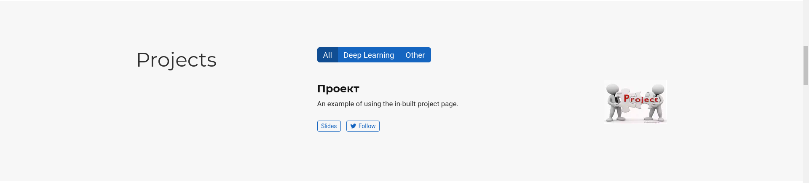
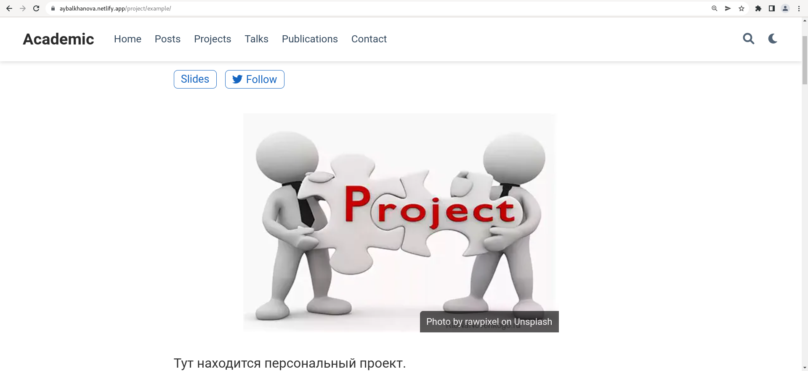
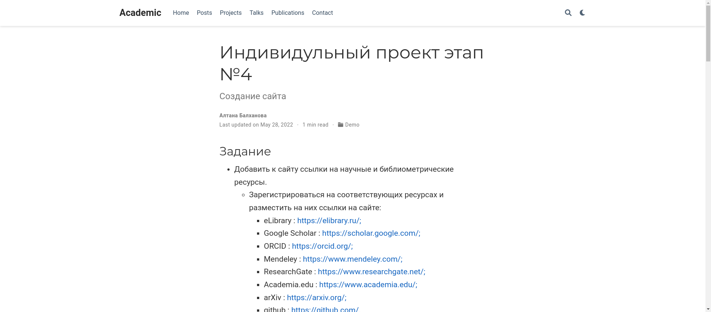
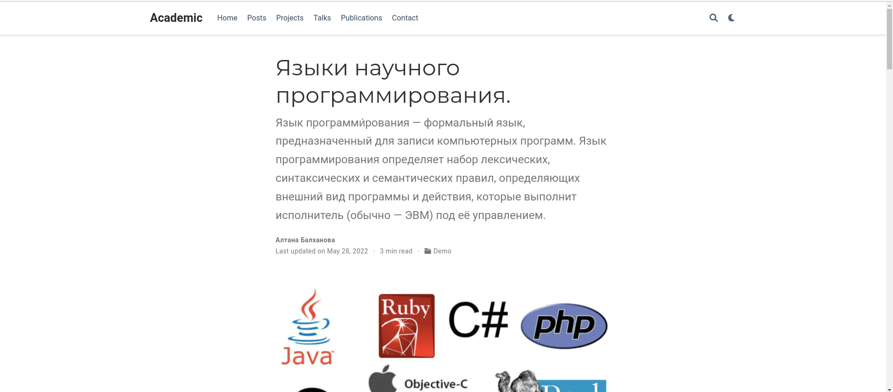

---
## Front matter
marp: true
lang: ru-RU
title: Презентация по индивидуальному проекту. Этап № 5.
author: |
	Балханова Алтана 
	НПМбд-03-21
institute: |
	\inst{1}RUDN University, Moscow, Russian Federation
date: NEC--2022, 28 April, 2022 Moscow, Russian Federation
## Formatting
toc: false
slide_level: 2
theme: metropolis
header-includes: 
 - \metroset{progressbar=frametitle,sectionpage=progressbar,numbering=fraction}
 - '\makeatletter'
 - '\beamer@ignorenonframefalse'
 - '\makeatother'
aspectratio: 43

---

# Презентация по индивидуальному проекту. Этап № 5.
Балханова Алтана 
НПМбд-03-21
RUDN University, Moscow, Russian Federation
28 April, 2022 Moscow, Russian Federation

---
# Пятый этап индивидуального проекта

---

## Цель работы

Добавить с сайту все остальные элементы.

---

# Задание

- Сделать записи для персональных проектов.
- Сделать пост по прошедшей неделе.
- Добавить пост на тему по выбору.
- Языки научного программирования.

---

## Сделала записи для персональных проектов

---

---

---

## Пост о выполнении индивидуального проекта

---

## Пост об языках научного программирования
		

---

## Вывод

- Я добавила с сайту все остальные элементы.

---
  # Спасибо за внимание

